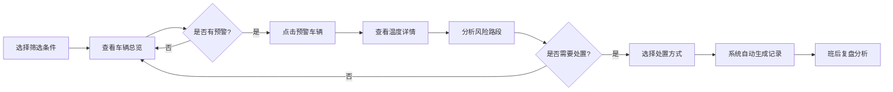

## 1. 产品概述
冷藏车路线温漂预警系统是面向物流调度员的实时监控 Web 应用，核心解决"运输途中哪里会升温、该不该改线"的决策问题。通过整合实时温度数据、路况信息和历史数据，为调度员提供可视化预警和智能处置建议。

- 核心价值：降低冷链运输货品变质风险，减少调度决策时间，提升运输安全合规性
- 目标用户：冷链物流调度员、运营管理人员

## 2. 核心 Features

### 2.1 用户角色
| 角色 | 注册方式 | 核心权限 |
|------|----------|----------|
| 调度员 | 企业账号登录 | 车辆监控、温度查看、预警处置、记录导出 |
| 管理员 | 企业账号登录 | 全部权限 + 系统配置、用户管理 |

### 2.2 功能模块
1. **在途车辆总览**：筛选器、地图视图、车辆卡片列表、预警统计
2. **路线温度详情**：温度曲线图表、开关门记录、前方服务区标记、路线风险分析
3. **预警处置中心**：处置按钮组、自动处置记录、历史处置复盘

### 2.3 页面详情
| 页面名称 | 模块名称 | 功能描述 |
|----------|----------|----------|
| 在途车辆总览 | 筛选器 | 支持按车队、货品类型、计划到达时间筛选 |
| 在途车辆总览 | 地图视图 | 显示车辆实时位置、行驶路线、温度预警路段 |
| 在途车辆总览 | 车辆卡片 | 显示车牌号、当前温度、设定温区、剩余里程、预警状态（绿/黄/红） |
| 在途车辆总览 | 预警统计 | 显示正常、预警、告警车辆数量统计 |
| 路线温度详情 | 温度曲线 | 展示过去30分钟温度变化趋势，支持平滑动画 |
| 路线温度详情 | 开关门记录 | 时间轴展示开关门事件及持续时间 |
| 路线温度详情 | 服务区信息 | 显示前方服务区位置、距离、预计到达时间 |
| 路线温度详情 | 风险路段分析 | 标记拥堵、高温历史路段及预计超温时间 |
| 预警处置中心 | 处置按钮 | 通知司机检查制冷机、建议绕行、联系收货方延后验收 |
| 预警处置中心 | 自动记录 | 自动生成处置时间、人员、内容、结果的完整记录 |
| 预警处置中心 | 复盘列表 | 按班次展示处置记录，支持筛选和导出 |

## 3. 核心流程

调度员登录系统后，首先通过筛选器选择关注的车队、货品类型和时间范围。系统在地图上实时展示所有在途车辆的位置和状态。当车辆卡片变黄或变红时，调度员点击进入详情页查看温度曲线和风险分析，判断是否需要采取措施。如需处置，点击对应处置按钮，系统自动生成处置记录。班后可通过处置记录进行复盘分析。

## 4. 用户界面设计

### 4.1 设计风格
- **主色调**：深海蓝 (#0F172A) 作为背景主色，体现专业、冷静的工业监控氛围
- **强调色**：
  - 正常状态：科技绿 (#10B981)
  - 预警状态：警示黄 (#F59E0B)
  - 告警状态：危险红 (#EF4444)
  - 信息提示：冰蓝色 (#38BDF8)
- **按钮风格**：方形微圆角 (4px)，实心填充，悬停时有轻微上浮和发光效果
- **字体**：
  - 标题/数字：JetBrains Mono 等宽字体，增强数据监控感
  - 正文：Noto Sans SC，确保中文可读性
- **布局风格**：三栏式布局（左侧筛选 + 中间地图 + 右侧车辆列表），卡片悬浮设计，深色主题
- **图标风格**：线性图标，统一 1px 描边，配合状态色使用

### 4.2 页面设计概述
| 页面名称 | 模块名称 | UI 元素 |
|----------|----------|----------|
| 在途车辆总览 | 筛选器 | 下拉选择器、日期时间选择器、搜索框 |
| 在途车辆总览 | 地图视图 | 暗色地图底图、车辆标记点（带温度数字）、路线渐变线、风险区域高亮 |
| 在途车辆总览 | 车辆卡片 | 状态色边框、车牌号大字、温度仪表盘图标、进度条显示剩余里程 |
| 在途车辆总览 | 预警统计 | 数字卡片，带状态色指示条，悬停动画 |
| 路线温度详情 | 温度曲线 | SVG 曲线图，实时数据点动画，温区参考线 |
| 路线温度详情 | 开关门记录 | 垂直时间轴，开门/关门图标，持续时间标签 |
| 路线温度详情 | 服务区信息 | 卡片式列表，距离进度条，预计到达时间 |
| 预警处置中心 | 处置按钮 | 大尺寸按钮组，图标+文字，点击反馈动画 |
| 预警处置中心 | 处置记录 | 表格视图，状态标签，时间戳，自动滚动到最新 |

### 4.3 响应式
- 采用 Desktop-first 设计，主视图最佳分辨率 1920×1080
- 平板端 (≥1280px)：三栏变两栏，车辆列表折叠为可展开面板
- 移动端 (≥768px)：单列布局，地图和列表切换显示，保留核心监控功能
- 触摸优化：按钮最小尺寸 48×48px，重要操作区域增大点击热区

### 4.4 动效设计
- 页面加载：地图从中心向外渐变显现，车辆卡片逐个滑入（stagger 动画）
- 预警状态变化：卡片边框呼吸灯效果，数字跳动动画
- 温度曲线：数据点从左向右依次绘制，新数据点有脉冲效果
- 按钮交互：点击时有缩放 (0.95) + 阴影扩散反馈
- 地图标记：车辆位置平滑移动，预警车辆有红色脉冲环
