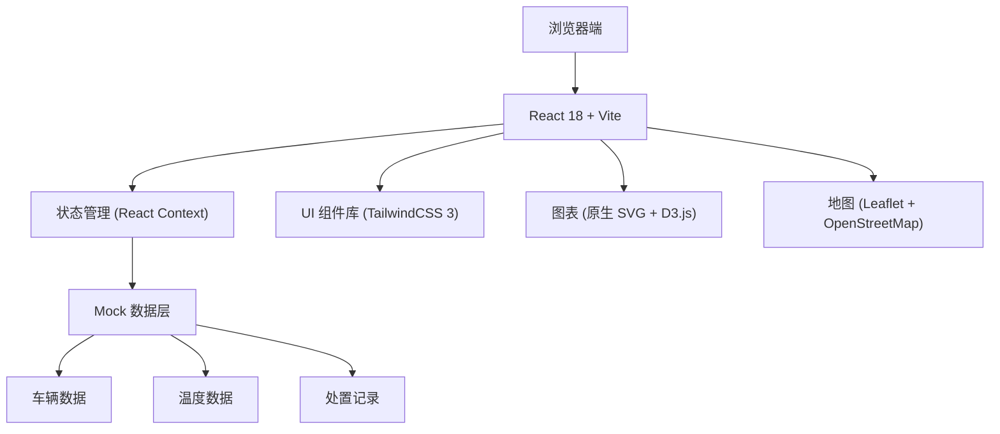
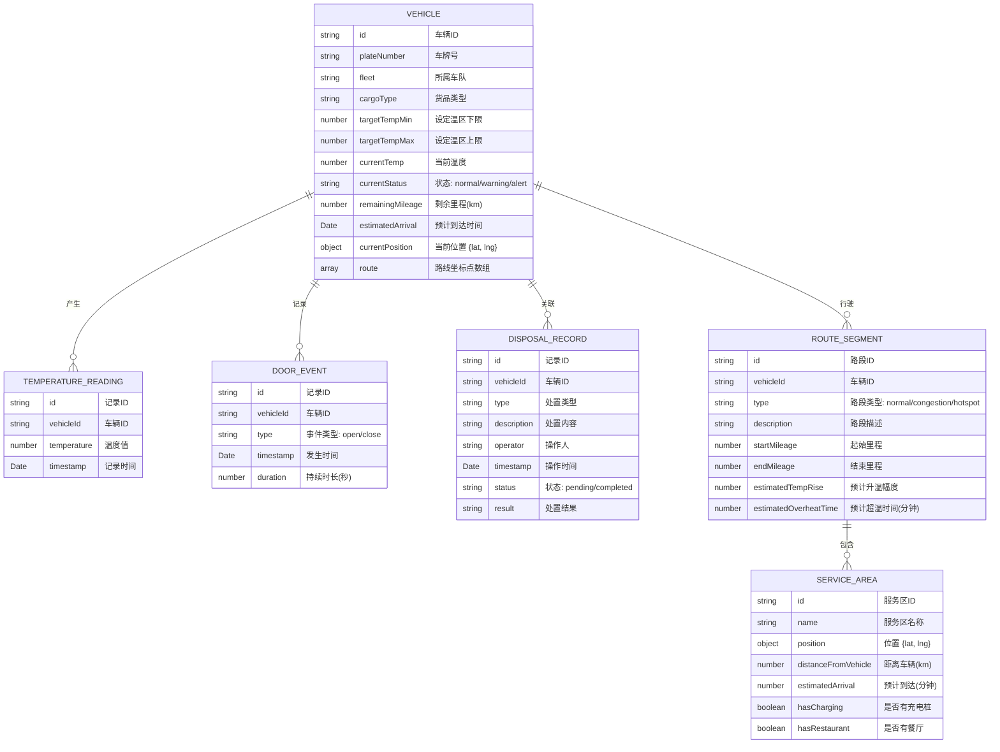

## 1. 架构设计



## 2. 技术描述

- **前端框架**: React@18.2.0 + TypeScript
- **构建工具**: Vite@5.0.0
- **样式方案**: TailwindCSS@3.4.0 + PostCSS
- **状态管理**: React Context + useReducer (轻量级，避免过度设计)
- **地图组件**: Leaflet@1.9.4 + react-leaflet@4.2.1 (开源地图，无需 API Key)
- **图表组件**: 原生 SVG 实现温度曲线，轻量可控
- **路由**: React Router@6.20.0
- **图标**: Lucide React@0.294.0 (线性图标库)
- **动画**: Framer Motion@10.16.0 (流畅的交互动画)
- **日期处理**: date-fns@2.30.0
- **数据**: 前端 Mock 数据，模拟实时更新

## 3. 目录结构

```
src/
├── components/          # 公共组件
│   ├── layout/         # 布局组件
│   ├── vehicle/        # 车辆相关组件
│   ├── temperature/    # 温度图表组件
│   ├── map/            # 地图组件
│   └── common/         # 通用组件（按钮、卡片等）
├── pages/              # 页面组件
│   ├── Overview.tsx    # 在途车辆总览
│   ├── Detail.tsx      # 路线温度详情
│   └── Disposal.tsx    # 预警处置中心
├── context/            # 状态管理
│   └── AppContext.tsx
├── mock/               # Mock 数据
│   ├── vehicles.ts
│   ├── temperature.ts
│   └── disposal.ts
├── types/              # TypeScript 类型定义
│   └── index.ts
├── hooks/              # 自定义 Hooks
│   ├── useVehicle.ts
│   ├── useTemperature.ts
│   └── useDisposal.ts
├── utils/              # 工具函数
│   ├── temperature.ts
│   └── format.ts
├── App.tsx
├── main.tsx
└── index.css
```

## 4. 路由定义

| Route | Purpose |
|-------|---------|
| `/` | 首页 - 跳转到车辆总览 |
| `/overview` | 在途车辆总览 - 地图、筛选器、车辆卡片列表 |
| `/detail/:vehicleId` | 路线温度详情 - 温度曲线、开关门记录、服务区 |
| `/disposal` | 预警处置中心 - 处置按钮、处置记录列表 |

## 5. 数据模型

### 5.1 数据模型定义



### 5.2 TypeScript 类型定义

```typescript
export type VehicleStatus = 'normal' | 'warning' | 'alert';
export type CargoType = 'frozen' | 'chilled' | 'pharmaceutical' | 'fresh';
export type DisposalType = 'notify_driver' | 'suggest_detour' | 'delay_receipt' | 'other';
export type DoorEventType = 'open' | 'close';
export type RouteSegmentType = 'normal' | 'congestion' | 'hotspot';

export interface Position {
  lat: number;
  lng: number;
}

export interface Vehicle {
  id: string;
  plateNumber: string;
  fleet: string;
  cargoType: CargoType;
  targetTempMin: number;
  targetTempMax: number;
  currentTemp: number;
  currentStatus: VehicleStatus;
  remainingMileage: number;
  totalMileage: number;
  estimatedArrival: Date;
  currentPosition: Position;
  route: Position[];
  driverName: string;
  driverPhone: string;
}

export interface TemperatureReading {
  id: string;
  vehicleId: string;
  temperature: number;
  timestamp: Date;
}

export interface DoorEvent {
  id: string;
  vehicleId: string;
  type: DoorEventType;
  timestamp: Date;
  duration?: number;
}

export interface RouteSegment {
  id: string;
  vehicleId: string;
  type: RouteSegmentType;
  description: string;
  startMileage: number;
  endMileage: number;
  estimatedTempRise: number;
  estimatedOverheatTime?: number;
}

export interface ServiceArea {
  id: string;
  name: string;
  position: Position;
  distanceFromVehicle: number;
  estimatedArrival: number;
  hasCharging: boolean;
  hasRestaurant: boolean;
}

export interface DisposalRecord {
  id: string;
  vehicleId: string;
  type: DisposalType;
  description: string;
  operator: string;
  timestamp: Date;
  status: 'pending' | 'completed';
  result?: string;
}

export interface FilterState {
  fleet: string | null;
  cargoType: CargoType | null;
  arrivalTime: Date | null;
  searchQuery: string;
}
```

## 6. 核心组件说明

### 6.1 地图组件 (MapView)
- 使用 react-leaflet 渲染交互式地图
- 支持暗色主题底图 (CartoDB Dark Matter)
- 车辆标记点显示实时温度，根据状态变色
- 路线使用渐变色，预警路段高亮显示
- 支持车辆点击查看详情

### 6.2 温度曲线组件 (TemperatureChart)
- 原生 SVG 实现，性能优异
- 显示过去30分钟温度数据，每2秒更新一次
- 绘制温区上下限参考线
- 数据点动画效果，新数据脉冲提示
- 鼠标悬停显示具体数值

### 6.3 车辆卡片组件 (VehicleCard)
- 边框颜色反映车辆状态（绿/黄/红）
- 预警状态时边框呼吸灯动画
- 显示车牌号、当前温度、设定温区、剩余里程
- 点击跳转详情页

### 6.4 处置按钮组件 (DisposalButtons)
- 三个主要处置按钮：通知司机、建议绕行、延后验收
- 点击后弹出确认对话框
- 自动生成处置记录，无需手动填写
- 按钮禁用状态防止重复操作

## 7. 性能优化

- 温度数据使用 Web Worker 模拟实时计算
- 地图标记点使用 Canvas 渲染，避免大量 DOM 节点
- 组件使用 React.memo 避免不必要重渲染
- 列表数据使用虚拟滚动（如车辆列表超过50辆）
- 动画使用 CSS transform 和 opacity，保证 60fps
